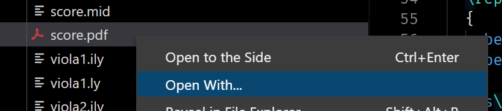
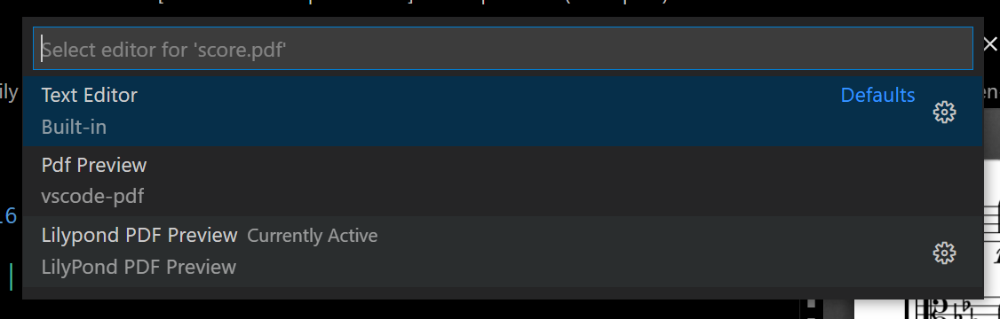

# LilyPond PDF Preview

Provides PDF Preview for LilyPond-generated PDFs. Supports point-and-click from PDF to source code.

Included in the [VSLilyPond](https://marketplace.visualstudio.com/items?itemName=lhl2617.vslilypond) extension.

## Features

### Point and Click 📜


## Usage Guide
1. Open your LilyPond-compiled PDF in VSCode using the `LilyPond PDF Preview` option. 
If you have multiple PDF previewer extensions, make sure that you choose `LilyPond PDF Preview` when opening the file.



2. Click on any of the noteheads etc. to use point-and-click.

## Requirements

* [VSCode](https://code.visualstudio.com/) 1.46.0 minimum
- (Optional but recommended): [VSLilyPond](https://marketplace.visualstudio.com/items?itemName=lhl2617.vslilypond) -- Provides advanced LilyPond language support

## Extension Settings

- Settings: See [docs/SETTINGS.md](docs/SETTINGS.md)

## Issues & FAQ

Please submit issues in the [GitHub repository](https://github.com/lhl2617/VSLilyPond-PDF-preview).

See the FAQ at [docs/FAQ.md](docs/FAQ.md).

## Contributing

- File bugs and/or feature requests in the [GitHub repository](https://github.com/lhl2617/VSLilyPond-PDF-preview)
- Pull requests are welcome in the [GitHub repository](https://github.com/lhl2617/VSLilyPond-PDF-preview)
- Buy me a Coffee ☕️ via [PayPal](https://paypal.me/lhl2617)

## Development

#### Requirements

- [VSCode](https://code.visualstudio.com/)
- `npm`

#### Setup

- Clone repository
  ```bash
  git clone https://github.com/lhl2617/VSLilyPond
  ```
- Install `npm` dependencies
  ```bash
  npm i
  ```
- Install `pdf.js` -- note that this requires `bash` -- Windows users are advised to run this step on WSL2 (but extension development can remain on Windows.)
  ```bash
  npm run pdfjs:install
  ```
- Hit `F5` to run an Extension Development Host.

  See [here](https://code.visualstudio.com/api/get-started/your-first-extension) for a detailed extension development guide.

#### Releasing

Releasing is done automatically via GitHub Actions. Bump the version in `package.json` and update `CHANGELOG.md` before merging into the default branch.

## Acknowledgements

- This extension is based on [`tomoki1207/vscode-pdf`](https://marketplace.visualstudio.com/items?itemName=tomoki1207.pdf), licensed under the MIT License.
- This extension bundles [`pdf.js`](https://github.com/mozilla/pdf.js), licensed under the Apache License 2.0.
