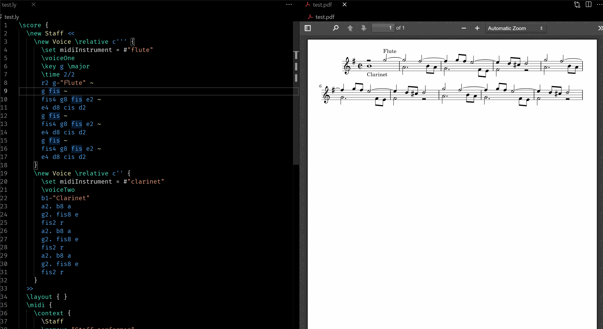

# LilyPond PDF Preview

[](https://marketplace.visualstudio.com/items?itemName=lhl2617.lilypond-pdf-preview)
[](https://vsmarketplacebadge.apphb.com/installs/lhl2617.lilypond-pdf-preview.svg)

Provides PDF Preview for LilyPond-generated PDFs. Supports point-and-click from PDF to source code.

Included in the [VSLilyPond](https://marketplace.visualstudio.com/items?itemName=lhl2617.vslilypond) extension.

## Features

### Two-way Point and Click 📄

#### Forward (Score to PDF)

#### Backward (PDF to Score)


## Requirements

* [VSCode](https://code.visualstudio.com/) 1.46.0 minimum
- (Optional but recommended): [VSLilyPond](https://marketplace.visualstudio.com/items?itemName=lhl2617.vslilypond) -- Provides advanced LilyPond language support
## Usage Guide
-  Open your LilyPond-compiled PDF in VSCode using the `LilyPond PDF Preview` option. 
If you have multiple PDF previewer extensions, make sure that you choose `LilyPond PDF Preview` when opening the file.


- Forward point-and-click
  - Click on the code location you are interested in, then execute the `LilyPond PDF Preview: Go to PDF location from Cursor` command 
    - Press `Ctrl`/`Cmd` + `Shift` + `P` to open the Command Palette
    - It is advisable to bind a shortcut to this feature as you please via the Command Palette
- Backward point-and-click
  - Click on any of the noteheads etc..


## Extension Settings

- Settings: See [docs/SETTINGS.md](docs/SETTINGS.md)
- Commands: See [docs/COMMANDS.md](docs/COMMANDS.md)

## Issues

Please submit issues in the [GitHub repository](https://github.com/lhl2617/VSLilyPond-PDF-preview).

## Contributing

- File bugs and/or feature requests in the [GitHub repository](https://github.com/lhl2617/VSLilyPond-PDF-preview)
- Pull requests are welcome in the [GitHub repository](https://github.com/lhl2617/VSLilyPond-PDF-preview)
- Buy me a Coffee ☕️ via [PayPal](https://paypal.me/lhl2617)

## Development

#### Requirements

- [VSCode](https://code.visualstudio.com/)
- `npm`

#### Setup

- Clone repository
  ```bash
  git clone https://github.com/lhl2617/VSLilyPond-PDF-preview
  ```
- Install `npm` dependencies
  ```bash
  npm i
  ```
- Hit `F5` to run an Extension Development Host.

  See [here](https://code.visualstudio.com/api/get-started/your-first-extension) for a detailed extension development guide.

#### Releasing

Releasing is done automatically via GitHub Actions. Bump the version in `package.json` and update `CHANGELOG.md` before merging into the default branch.

## Acknowledgements

- This extension is based on [`tomoki1207/vscode-pdf`](https://marketplace.visualstudio.com/items?itemName=tomoki1207.pdf), licensed under the MIT License.
- This extension bundles [`pdf.js`](https://github.com/mozilla/pdf.js), licensed under the Apache License 2.0.
